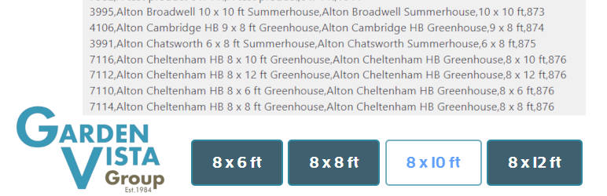

# gvg_product_range 

* Contributors: bobbingwide
* Donate link: https://www.oik-plugins.com/oik/oik-donate/
* Tags: Product range, buttons, taxonomy
* Requires at least: 6.2
* Tested up to: 6.8-RC4
* Requires PHP: 7.3
* Stable tag: 0.3.0
* License: GPLv2 or later
* License URI: http://www.gnu.org/licenses/gpl-2.0.html

## Description 
Implements the Product Range taxonomy for products which are sold in various sizes.

Examples:

```
3995,Alton Broadwell 10 x 10 ft Summerhouse,Alton Broadwell Summerhouse,10 x 10 ft,873
4106,Alton Cambridge HB 9 x 8 ft Greenhouse,Alton Cambridge HB Greenhouse,9 x 8 ft,874
3991,Alton Chatsworth 6 x 8 ft Summerhouse,Alton Chatsworth Summerhouse,6 x 8 ft,875
7116,Alton Cheltenham HB 8 x 10 ft Greenhouse,Alton Cheltenham HB Greenhouse,8 x 10 ft,876
7112,Alton Cheltenham HB 8 x 12 ft Greenhouse,Alton Cheltenham HB Greenhouse,8 x 12 ft,876
7110,Alton Cheltenham HB 8 x 6 ft Greenhouse,Alton Cheltenham HB Greenhouse,8 x 6 ft,876
7114,Alton Cheltenham HB 8 x 8 ft Greenhouse,Alton Cheltenham HB Greenhouse,8 x 8 ft,876
```

where fields are:
- product ID
- product title
- product range taxonomy term name
- product range taxonomy term ID

* Note: The first 3 of these products only have one item in the range so buttons are not displayed for these products.

- Use the Tools > GVG Bulk Update > Product Ranges tab to initialise the product range taxonomy term for each product.
- Responds to the 'display_gvg_product_range' action hook to display a set of buttons for each product in the range indicating the dimensions ( width x length ) of the product.
- Automatically sets the product range taxonomy term from the product's title when the product is created / updated

Supported formats for the dimensions are:

- w x l ft
- w' x l'
- w" x l'
- wwwwxllllmm

where w is the width and l is the length

In v0.1.0 the Product Ranges table was extended to display

- Visibility - Catalog visibility should be visible for all products
- Dimensions - as extracted from the product title
- Size - the value of the Product size field. An X indicates that the size doesn't match the title
- Brand - the associated Brand for the Product
- Building-Type - the Product's Building Type attribute
- Material - the Product's Material attribute

## Installation 
1. Upload the contents of the gvg_product_range plugin to the `/wp-content/plugins/gvg_product_range' directory
1. Activate the plugin through the 'Plugins' menu in WordPress
1. Use Tools > GVG Bulk update > Product Ranges to set the product range for each product


## Screenshots 
1. Product Ranges tab

## Upgrade Notice 
# 0.3.0 
Update to avoid Fatal error when using Elementor.

# 0.2.0 
Update for the product range duplicate filter and dropdown logic

# 0.1.0 
Improved Product Ranges tab.

# 0.0.0 
New plugin to display product range buttons - one for each size in the product range.

## Changelog 
# 0.3.0 
* Changed: Improve styling when a product doesn't have dimensions #11
* Fixed: Avoid doing product range stuff when using Elementor #10
* Tested: With WordPress 6.8-RC3
* Tested: With PHP 8.3

# 0.2.0 
* Changed: Implement product range duplicate filter and dropdown logic #7
* Tested: With WordPress 6.4-RC2
* Tested: With PHP 8.0, PHP 8.1 and PHP 8.2

# 0.1.0 
* Changed: Product Ranges tab: Display additional fields #6.
* Changed: Format From price with 2 decimals #5

# 0.0.0 
* Changed: Product Range update: Only set the product_range taxonomy term if not set or different from required #2
* Changed: Sort dimensions #3.
* Added: Add wp_insert_post action hook to update the product_range term #4
* Added: Implement display_gvg_product_range action hook to display buttons for each product in the range #3
* Added: Add logic to set the product_range term. #2
* Added: Add logic to get dimensions #1
* Added: Prototype logic to find product_range term name for all products #1 #2
* Tested: With PHP 8.0
* Tested: With WordPress 6.2

## Further reading 
- GVG Product Range extends GVG Bulk update which uses oik shared libraries in the _GVG Bulk update_ admin page
- Style the product range buttons in the VGC theme
